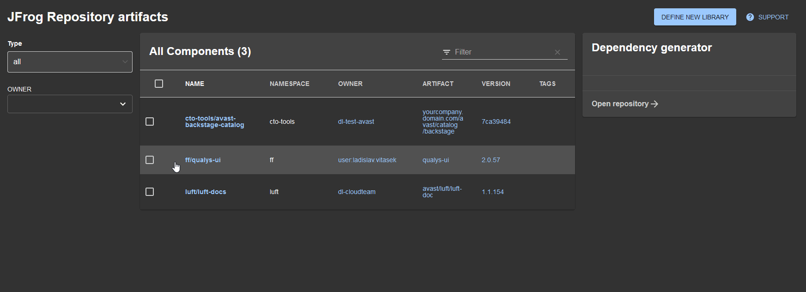
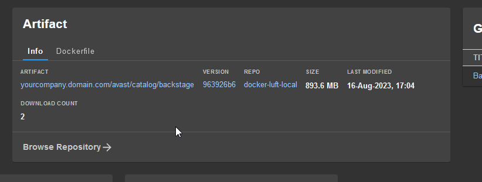

# Backstage JFrog artifactory libraries plugin

The Backstage `jfrog-artifactory-libs` frontend plugin provides a simple way to display generated artifact (library)
details like - group, artifact, repository, what is the latest version, and it simply allows to copy library definition
for the package managers.   
Nowadays, the plugin supports these package managers types in JFrog: Maven, Gradle, Sbt, Pypi, Docker.


<!-- TOC -->

- [Backstage jfrog-artifactory-libs plugin](#backstage-xkcd-plugin)
  - [Installation](#installation)
  - [Integration](#integration)
  - [Configuration](#configuration)
    - [Support for scaffolding](#support-for-scaffolding) 
  - [How it works](#how-it-works)
  - [Changes](#changes)
  - [Contributing](#contributing)
    - [Development](#development)
  - [Future plans](#future-plans)
  - [License](#license)
  <!-- TOC -->

## Installation

To install the plugin, you'll need to add it to your Backstage app's dependencies using either Yarn or NPM.

**Yarn**

```shell
yarn add --cwd packages/app backstage-plugin-jfrog-artifactory-libs
```

## Integration

Once you've installed the plugin, you'll need to integrate it into your Backstage app. To do so, you'll need to following code into your BS instance:

### JFrogLibArtifactCard
Add the JFrogLibArtifactCard component to the `EntityPage.tsx` in your app:

```typescript jsx
import {JFrogLibArtifactCard, isJfrogArtifactAvailable} from 'backstage-plugin-jfrog-artifactory-libs';
//....
const overviewContent = (
// ...
    <EntitySwitch>
        //...
        <EntitySwitch.Case if={isJfrogArtifactAvailable}>
            <Grid item md={4}>
                <JFrogLibArtifactCard/>
            </Grid>
        </EntitySwitch.Case>
        //...
    </EntitySwitch>
    // ...
);
```
### JFrogLibVerPage
If you want to browse libraries you can enable this component in your `App.tsx` file. It shows all component entities containing `jfrog.com/artifactory-artifact` attribute.



```typescript jsx
const routes = (
  <FlatRoutes>
    //....
    <Route path="/libver" element={<JFrogLibVerPage topComponents={<DefineNewLibraryButton />} />}>
    </Route>
    //....
  </FlatRoutes>
);
```


### Explore page - JFrogLibVerPageContent
This is a subcomponent of `JFrogLibVerPage` component. It's possible to integrate it for instance into your Explore page.
```typescript jsx
import { JFrogLibVerPageContent } from 'backstage-plugin-jfrog-artifactory-libs';
//....

        <ExploreLayout
                title={`Explore the ${organizationName} ecosystem`}
                subtitle="Discover solutions available in your ecosystem"
        >
              // ...
          <ExploreLayout.Route path="libver" title="Libraries">
            <JFrogLibVerPageContent />
            />
          </ExploreLayout.Route>
          //  ...
        </ExploreLayout>

    // ...
);
```

### App-config.yaml
Set up a proxy for the JFrog API by adding the following configuration to your `app-config.yaml` file:

```yaml
  '/artifactory-proxy/':
    target: 'https://your-jfrog-artifactory-instance.com'
    headers:
      # if you use Jfrog instance for anonymous user token is not required, but it is also required for Docker package type
      Authorization: Bearer ${ARTIFACTORY_TOKEN}
      X-Result-Detail: 'properties'
      Accept: '*'
```

You have to also reference your artifactory URL (used for UI browse links) and your proxy configuration.

```yaml
jfrog:
  artifactory:
    url: 'https://your-jfrog-artifactory-instance.com'
    proxyPath: '/artifactory-proxy/' # optional, /artifactory-proxy/ is default value 
```

### Catalog-info.yaml

Artifact details are correlated to Backstage entities using an annotation added in the entity's catalog-info.yaml file.

```yaml
  metadata:
    # -- required values --
    jfrog.com/artifactory-artifact: 'artifact-name'
    jfrog.com/artifactory-repo: 'maven-local'

    jfrog.com/artifactory-group: 'com.mycompany' # optional string - can be blank for pypi, necessary for Maven repos

    # -- optional values --
    jfrog.com/artifactory-scope: 'compile' # optional string, one of these [compile, test,provided,runtime,classpath,optional]
    jfrog.com/artifactory-packaging: 'aar' #optional string, eg. `aar` 

```

And that's it! The plugin should now be integrated into your Backstage app, and you should see the Artifact card when
you navigate to the entity page where it's included.

For a docker image you define repository and artifact name. Both formats are supported:
```yaml
  metadata:
    # -- required values --
    jfrog.com/artifactory-artifact: 'docker.mydomain.com/mygroup/my/artifact-name' # or simply 'mygroup/my/artifact-name' 
    jfrog.com/artifactory-repo: 'docker-local'
```



## Configuration

`JFrogLibArtifactCard` has following default properties:

```typescript typescript jsx
LibArtifactCard.defaultProps = {
    title: 'Artifact', // title of the card
    browseRepositoryLinkTitle: 'Browse Repository', // Card deep link title
    showGradle: true, // whether to show Gradle package manager tab
    showMaven: true, // whether to  show Maven package manager tab
    showSbt: true, // whether to  show Sbt package manager tab
    showPip: true, // whether to  show Pip package manager tab
    showDockerfile: true, // whether to  show Dockerfile tab
    // it hides Maven and Gradle tabs if the current repository package type is `PyPi`
    autohideTabs: true,
    showBrowseRepositoryLink: true // whether to show Browse to URL deep link under bottom of the Card
    // which link to open
    browseLink: browseLinkDefault,
};

```
### Support for scaffolding
In [this document](./doc/SCAFFOLDING.md) you can find detailed information how to integrate this plugin into scaffolding templates.
It also adds a new extension UI component called `ArtifactRepositoryPicker` for interactive repository selection. 

## How it works

Plugin uses JFrog APIs to find latest version. It's necessary to specify `ARTIFACTORY_TOKEN` in the `app-config.yaml`
file if you don't allow to access API for anonymous user.

## Changes 
Version 1.0.9 
 - JFrogLibVerPageContent and JFrogLibVerPage components added
 - (!) renamed LibArtifactCard into JFrogLibArtifactCard

## Contributing

Don't hesitate to contribute to the plugin. This is my first TypeScript/React/Backstage product so please be gentle to
me...

### Development

Copy plugin content into your `plugins` directory, and add a dependency into app/package.json as described above.

## Future plans

- More tests
- More package managers support
- Multiple artifacts defined in one entity
- Multiple artifactories instances?

## License

This plugin is licensed under the Apache 2.0 License.

