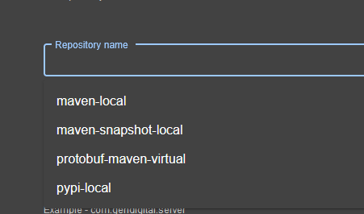

## Scaffolding snippets

### Template

```yaml
# ... metadata.annotations...
libraryArtifact:
  title: Library Artifact
  type: object
  properties:
    jfrogArtifactoryArtifact:
      title: Artifact name
      type: string
      description: 'Generated artifact name'
      ui:help: 'Example - my-artifact-name'
      examples:
        - 'my-artifact-name'
    jfrogArtifactoryRepo:
      title: Repository name
      type: string
      description: 'Required if you specify artifact - JFrog artifact repository name'
      ui:help: 'Example - maven-local'
      examples:
        - 'maven-local'
    jfrogArtifactoryGroup:
      title: Group name
      type: string
      description: 'Can be blank for pypi, necessary for Maven repos - define library artifact group.'
      ui:help: 'Example - com.gendigital.server'
      examples:
        - 'com.gendigital.server'
    jfrogArtifactoryScope:
      title: Artifact scope
      type: string
      description: 'Optional - library artifact scope'
      ui:help: 'Example - compile'
      enum:
        ['', 'compile', 'test', 'provided', 'runtime', 'classpath', 'optional']
      examples:
        - compile
    jfrogArtifactoryPackaging:
      title: Artifact packaging
      type: string
      description: 'Optional - library packaging type'
      ui:help: 'Example - aar'
      examples:
        - aar
```

Alternatively you can use a Scaffolding UI component `ArtifactRepositoryPicker` for Repository name field (`jfrogArtifactoryRepo`). It can help to users choose correct value + it adds a validation, only existing repository has to be selected.



First you have to register ArtifactRepositoryPickerFieldExtension in your App.tsx.

```tsx
import { ScaffolderFieldExtensions } from '@backstage/plugin-scaffolder-react';
// ...
const routes = (
  <FlatRoutes>
    // ...
    <Route path="/create" element={<ScaffolderPage />}>
      <ScaffolderFieldExtensions>
        <ArtifactRepositoryPickerFieldExtension />
      </ScaffolderFieldExtensions>
    </Route>
    // ...
  </FlatRoutes>
);
```

Update template adding `ui:field` and `ui:options` definitions:

```yaml
jfrogArtifactoryRepo:
  title: Repository name
  type: string
  description: 'Required if you specify artifact - JFrog artifact repository name'
  ui:field: ArtifactRepositoryPicker
  ui:options:
    allowArbitraryValues: true
    excludedRegex: ['/legacyRepoName/i']
    allowedTypes: ['virtual']
    allowedPackageTypes: ['maven', 'pypi', 'docker']
  ui:help: 'Example - maven-local'
  examples:
    - 'maven-local'
```

You can filter any repository you want using `allowedTypes` and `allowedPackageTypes` property.
If you want to exclude some old repository, use `excludedRegex` property and set one or more regex.

#### Steps - fetch base

```
   ....
    - id: fetch-base
        name: Fetch Base
        action: fetch:template
        input:
        url: ./content
        values:
            libraryArtifact: ${{ parameters.annotations.libraryArtifact }}
    ....
```

### Component.v2alpha1.schema.json

```

"jfrog.com/artifactory-artifact": {
    "type": "string",
    "description": "Library Artifact name",
    "examples": ["my-artifact-name"]
},
"jfrog.com/artifactory-repo": {
    "type": "string",
    "description": "JFrog artifact repository name",
    "examples": ["maven-local"]
},
"jfrog.com/artifactory-group": {
    "type": "string",
    "description": "JFrog artifact group name",
    "examples": ["com.gendigital.server"]
},
"jfrog.com/artifactory-scope": {
    "type": "string",
    "description": "Optional - library artifact scope",
    "enum": ["compile", "test", "provided", "runtime", "classpath", "optional", ""],
    "examples": ["compile"]
},
"jfrog.com/artifactory-packaging": {
    "type": "string",
    "description": "Artifact packaging type",
    "examples": ["aar"]
},

```

### Template catalog info yaml

```
    { % if values.libraryArtifact.jfrogArtifactoryArtifact|length -% }
    "jfrog.com/artifactory-artifact": ${{ values.libraryArtifact.jfrogArtifactoryArtifact | dump }}
    { % endif -% }
    { % if values.libraryArtifact.jfrogArtifactoryRepo|length -% }
    "jfrog.com/artifactory-repo": ${{ values.libraryArtifact.jfrogArtifactoryRepo | dump }}
    { % endif -% }
    { % if values.libraryArtifact.jfrogArtifactoryGroup|length -% }
    "jfrog.com/artifactory-group": ${{ values.libraryArtifact.jfrogArtifactoryGroup | dump }}
    { % endif -% }
    { % if values.libraryArtifact.jfrogArtifactoryScope|length -% }
    "jfrog.com/artifactory-scope": ${{ values.libraryArtifact.jfrogArtifactoryScope | dump }}
    { % endif -% }
    { % if values.libraryArtifact.jfrogArtifactoryPackaging|length -% }
    "jfrog.com/artifactory-packaging": ${{ values.libraryArtifact.jfrogArtifactoryPackaging | dump }}
    { % endif -% }

```
